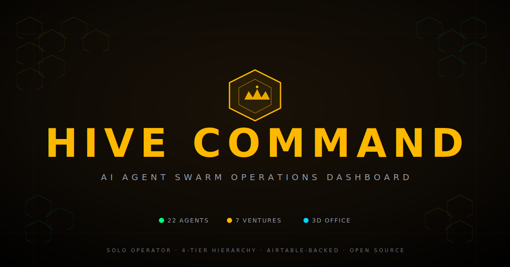

<p align="center">
  
</p>

<h1 align="center">HIVE COMMAND <sup>(Ruflo)</sup></h1>

<p align="center">
  <b>An AI agent swarm operations dashboard for the solo operator.</b><br/>
  <i>Embodied 3D office · Per-agent model assignment · Live cost tracking · Multimodal output</i>
</p>

<p align="center">
  <a href="https://hive-command-lemon.vercel.app"></a>
</p>

<p align="center">
  <a href="https://hive-command-lemon.vercel.app"></a>
  
  
  
  
</p>

---

A single visual command center to monitor, direct, and review AI agents organised in a 4-tier hierarchy (**Commander → Directors → Managers → Worker Agents**) across multiple ventures. Honeycomb visual identity. Dark tactical theme. Airtable-backed live data. Optional Ollama / Claude / OpenAI / Gemini integration.

> **🟢 Live demo:** [hive-command-lemon.vercel.app](https://hive-command-lemon.vercel.app)
> _Demo runs without Airtable — visitors see a generic 14-agent seed. Fork + deploy your own for live data._

## What's inside

### 🐝 The Swarm
- React Flow node-graph view of your full hierarchy
- Grid view with live task progress
- Per-agent **AI model selector** — assign Claude Opus to your Commander, Haiku to your workers, watch cost track per-agent

### 🎯 The Commander Loop
- Autonomous orchestration: **Decompose → Distribute → Execute → Collect → Review**
- Each phase routes through your assigned per-agent model
- Token + cost tracking via Vercel-proxied AI calls (no client-side key leaks)
- Pause / resume / stop mid-run

### 🏢 The 3D Office (Three.js)
- Embodied low-poly agents that **walk between POIs** (desk → whiteboard → coffee → meeting table)
- **Status-driven behaviors** — active = typing bob, walking = gait + footstep dust, talking = head swivel, blocked = slumped
- **Tier-distinct visuals** — Commander crown + cape, Director briefcase, Manager headset, Tier-3 tablet
- **Talking interactions** — when two agents stand close, contextual dialogue bubbles appear
- **Speech bubbles** float above every agent with an active task
- **NavMesh-light obstacle repulsion** — agents skirt around furniture
- **Dynamic venture lighting** — color-coded point lights per zone, auto-distributed from your VENTURES config

### 📊 Analytics
- 6 KPI cards: agents, active now, tasks today, AI spend, AI tokens, cashflow target
- Status distribution donut (real data)
- Task volume bar chart (7-day, from Tasks table)
- Per-venture task breakdown (30-day)
- **AI spend per model** horizontal bar — see which agents are burning your budget
- Recent AI calls log

### 🎨 Multimodal Outputs
- **AI Image Studio** on the Outputs page: type a description → render via **Gemini Nano Banana** (if configured) or **DALL-E 3** fallback
- Generated images appear as output cards with the image inline
- Standard review flow: approve / revision / reject / export PDF / DOCX / email

### 📦 Team Templates
- 6 industry presets that load in one click:
  - Marketing Agency · E-Commerce Brand · SaaS Startup · Consulting Firm · Content Studio · Research Lab
- Each template ships a wired Commander + Directors + Managers + Workers with mandates, tools, statuses
- Active template persists across reloads via localStorage

## Stack

- **React 19** + **Vite 8** + **Tailwind 4**
- **Three.js** + **React Three Fiber 9** + **Drei 10**
- **Framer Motion 12** for UI motion
- **Zustand 5** for state
- **React Router 7**
- **Recharts 3** for analytics
- **@xyflow/react** for the hierarchy graph
- **Airtable** as the live backend (5 tables: Agents, Directives, Tasks, Outputs, Activity Log)
- **Vercel serverless functions** for the AI proxy (`/api/ai`) — keeps keys server-side
- Optional: **Ollama** (local), **Claude**, **OpenAI**, **Gemini**

## Architecture

```
src/
├── components/
│   ├── atoms/        # StatusDot, TierLabel, VentureBadge, GlowButton, …
│   ├── molecules/    # AgentCardCompact, TaskFeedItem, FilterBar, StatusBar, …
│   ├── organisms/    # AgentGrid, AgentDetail, AgentCanvas, RetroOffice3D, …
│   ├── 3d/           # OfficeFloor, OfficeFurniture, AgentAvatar, OfficeEnvironment
│   ├── templates/    # DashboardShell
│   └── pages/        # SwarmPage, CommanderPage, VenturesPage, …
├── store/            # Zustand stores (agents, directives, tasks, outputs, aiUsage, …)
├── hooks/            # useAirtableSync, useCommandBar, useCommanderLoop, …
├── lib/              # airtable, llmClient, ollama, commanderLoop, aiPricing, dialogue, pathfinding
├── data/             # constants (VENTURES, TIERS, …), agents (demo seed), teamTemplates
├── motion/           # Animation variants
└── styles/           # CSS custom properties + global

api/
├── ai.js             # AI proxy: Ollama / Claude / OpenAI / Gemini + image generation
└── airtable.js       # Airtable proxy (rate-limited)
```

## Quick start

```bash
git clone https://github.com/Anubisseth/hive-command.git
cd hive-command
npm install
cp .env.example .env   # fill in your Airtable + AI credentials
npm run dev            # → http://localhost:5173
```

Full setup including the **Airtable schema you need to create** is in [SETUP.md](./SETUP.md).

## How to use

The full operator's guide — every page, every workflow, every keyboard shortcut — is in [**USER_MANUAL.md**](./USER_MANUAL.md).

## Want to contribute?

Fork the repo, make a branch, open a PR. Details in [**CONTRIBUTING.md**](./CONTRIBUTING.md).

## Pages

| Route | Page | What it does |
| --- | --- | --- |
| `/swarm` | Swarm | Agent grid + node-graph view, with templates loader |
| `/commander` | Commander | Issue directives + run autonomous loop |
| `/ventures` | Ventures | Per-venture roll-ups + editable KPIs |
| `/directives` | Directives | Active + completed list with Complete / Cancel |
| `/outputs` | Outputs | Deliverable review + AI Image Studio |
| `/office` | 3D Office | Embodied Three.js characters |
| `/analytics` | Analytics | KPIs + status / task / spend charts |
| `/settings` | Settings | Integrations, AI, display, database, security |

## Conventions

- **Atomic Design** under `src/components/` (atoms → molecules → organisms → templates → pages)
- All colors via CSS custom properties (`src/styles/index.css`)
- All animation variants live in `src/motion/`
- Agent / venture data lives in Airtable when configured; `src/data/agents.js` + `src/data/constants.js` are fallback seeds
- Airtable mutations are optimistic (Zustand first, sync in background)
- AI keys NEVER prefixed with `VITE_` when used by the server (they stay server-side via `/api/ai`)

## Commands

```bash
npm run dev        # Dev server on :5173
npm run build      # Production build
npm run preview    # Preview production build
npm run lint       # ESLint
```

## Deploy

```bash
vercel link        # Connect to a Vercel project
vercel              # Preview deploy
vercel --prod       # Production deploy
```

Or push to your `main` branch — if you connect the repo to Vercel, it auto-deploys.

## Security notes

- `.env` is gitignored — never commit it
- API keys with the `VITE_` prefix are bundled into the browser. **Don't** put production AI keys there. Use the server-side `OPENAI_API_KEY`, `ANTHROPIC_API_KEY`, `GEMINI_API_KEY`, `OLLAMA_URL` in Vercel env vars, which the `/api/ai` proxy reads
- Set `HIVE_ACCESS_TOKEN` and `ALLOWED_ORIGIN` in Vercel to lock down the AI proxy — otherwise anyone who knows your URL can call it
- Rate-limit story: `/api/airtable` is rate-limited; `/api/ai` is not yet — consider adding similar limits before sharing the URL publicly

## License

MIT. Use it, fork it, ship it.

---

<p align="center">
  <sub>
    Made for the solo operator who wants to run a team of AI agents without losing sight of any of them.<br/>
    🐝 <a href="https://github.com/Anubisseth/hive-command">github.com/Anubisseth/hive-command</a> ·
    🟢 <a href="https://hive-command-lemon.vercel.app">live demo</a>
  </sub>
</p>
